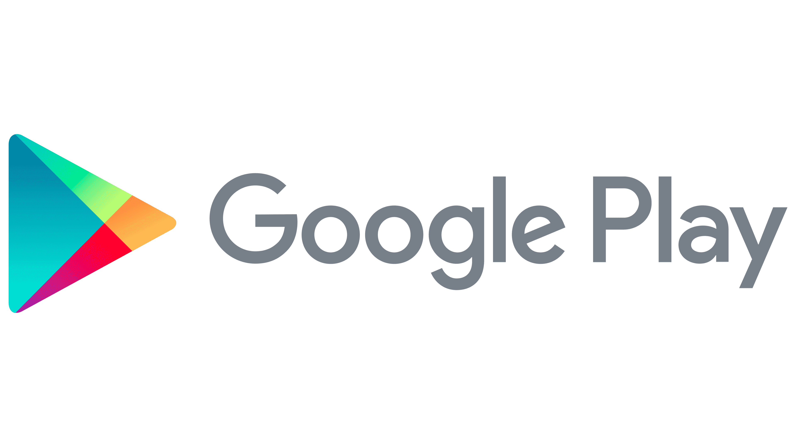

# 원신&붕스타 위젯 / Genshin StarRail Widget

개인 프로젝트로 개발 된 코틀린 언어를 사용한 안드로이드 앱이에요.

- 연락처: donggi9313@gmail.com

## 소개

호요버스가 제작한 오픈월드 어드벤처 비디오 게임, 원신의 시간당 충전 재화인 레진의 보유량을 위젯으로 실시간 확인 가능하도록 만든 앱이에요.

현재는 레진 뿐만 아니라, 탐험, 선계 주화 등의 정보를 알림으로 받을 수 있고 자동으로 HoYoLAB 출석체크를 진행할 수 있어요.

1. 이 앱을 정상적으로 사용하기 위해서 uid와 cookie 값이 필요해요.
2. 앱에 해당 값을 입력하고, 위젯을 생성하면 자신의 현재 레진, 최대 충전까지 남은 시간을 비롯한 여러 정보를 더욱 빠르게 확인할 수 있어요.

## 개발 환경

- [Android Studio Bumblebee](https://developer.android.com/studio/intro)
- [Koltin](https://developer.android.com/kotlin)
- [Hilt](https://dagger.dev/hilt/)
- Clean Architecture

- [Rx](https://reactivex.io/)
- [Coroutine](https://developer.android.com/kotlin/coroutines?hl=ko)
- [Flow](https://developer.android.com/kotlin/flow?hl=ko)

- [Retrofit2](https://square.github.io/retrofit/)
- [WorkManager](https://developer.android.com/jetpack/androidx/releases/work?hl=ko)
- [Room](https://developer.android.com/training/data-storage/room/)

## Application Version

- minSdkVersion : 23
- targetSdkVersion : 32

## ScreenShots

|  
메인 화면
 |  
계정 연동 화면
 |  
디자인 화면
 |
| ------------------------------------------------------------ | ------------------------------------------------------------ | ------------------------------------------------------------ |
|  
디자인 화면
 |  
디자인 예시
 |  
위젯 예시
 |
